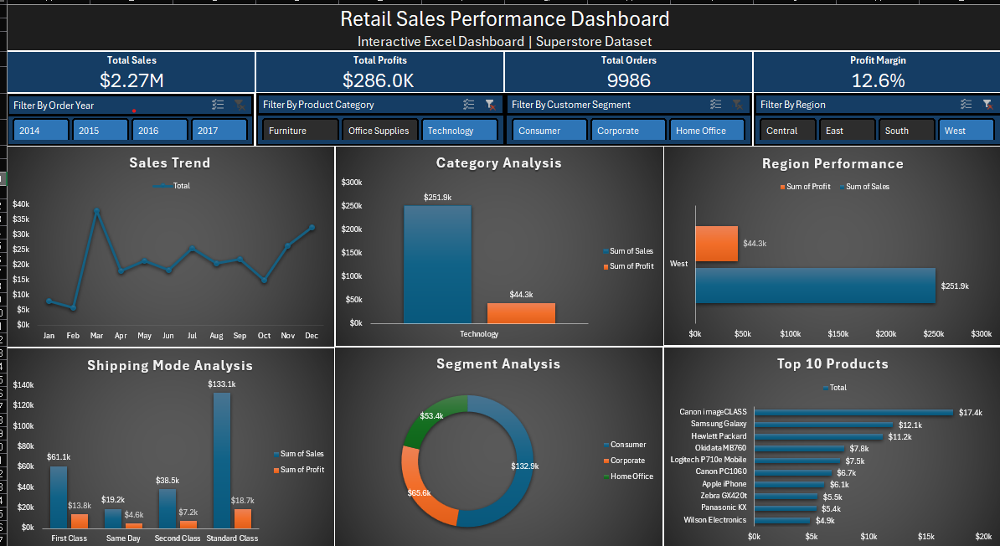
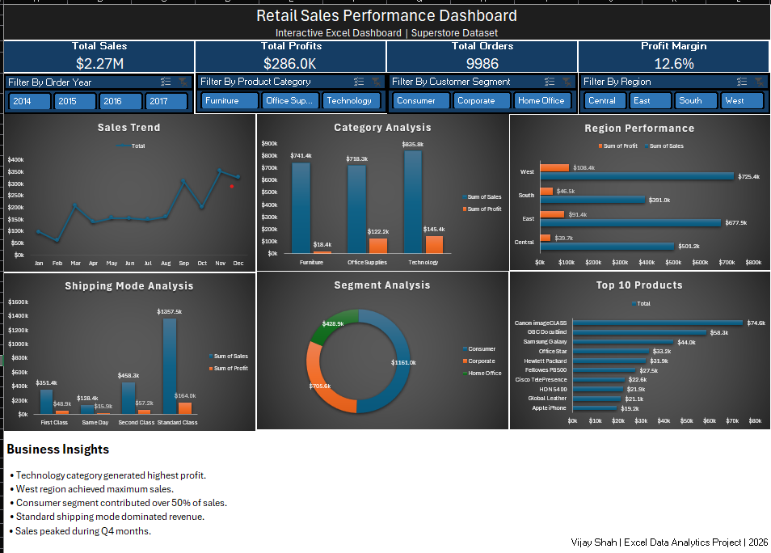

# Retail Sales Performance Dashboard (Excel)

## Project Overview
This project is an interactive **Retail Sales Performance Dashboard** built entirely in Microsoft Excel using the Superstore dataset. The dashboard helps analyze business performance across sales, profit, products, customer segments, shipping modes, and regional trends.

The goal of this project is to demonstrate practical **Data Analytics**, **Business Intelligence**, and **Dashboard Design** skills using Excel.

---

## Dashboard Preview

### Dashboard with Filters Applied


### Dashboard Overview


---

## Objectives
The dashboard answers key business questions such as:

- What are the total sales, profits, and profit margins?
- Which region generates the highest sales?
- Which product categories are most profitable?
- How do sales trends change over time?
- Which customer segment contributes the most revenue?
- Which shipping mode performs best?
- What are the top-selling products?

---

## Tools & Technologies Used

- Microsoft Excel
- Pivot Tables
- Pivot Charts
- Slicers
- Conditional Formatting
- Excel Formulas
- Data Cleaning Techniques

---

## Dataset Used

Dataset: Superstore Sales Dataset

Source:
https://www.kaggle.com/datasets/vivek468/superstore-dataset-final

---

## Dashboard Features

### KPI Cards
The dashboard includes key business metrics:

- Total Sales
- Total Profit
- Total Orders
- Profit Margin %

### Interactive Filters (Slicers)

Users can dynamically filter the dashboard by:

- Order Year
- Product Category
- Customer Segment
- Region

### Visualizations Included

| Visualization | Purpose |
|---|---|
| Line Chart | Monthly Sales Trend |
| Column Chart | Category Analysis |
| Bar Chart | Regional Performance |
| Donut Chart | Segment Contribution |
| Horizontal Bar Chart | Top 10 Products |
| Comparative Bar Chart | Shipping Mode Analysis |

---

## Key Insights

- Technology category generated the highest profit.
- West region achieved the highest overall sales.
- Standard shipping mode contributed the largest revenue share.
- Consumer segment accounted for more than 50% of total sales.
- Sales showed strong growth during the final quarter of the year.
- Higher discounts negatively impacted profitability in several categories.
- Some high-selling products generated low profit margins, indicating pricing inefficiencies.

---

## Data Cleaning & Preparation

The following data preparation steps were performed:

- Removed duplicate records
- Verified missing/null values
- Formatted date columns
- Created calculated columns:
  - Year
  - Month
  - Profit Margin %
  - Order Processing Days
- Standardized data formatting

---

## Project Structure

```text
Retail-Sales-Dashboard-Excel/
│
├── Dataset/
│   └── Superstore.csv
│
├── Dashboard/
│   └── Retail_Sales_Dashboard.xlsx
│
├── Images/
│   ├── dashboard_filtered.png
│   └── dashboard_overview.png
│
└── README.md
```

---

## Business Questions Solved

1. Which region contributes the highest revenue?
2. Which product category is most profitable?
3. What are the monthly sales trends?
4. Which customer segment contributes the most sales?
5. Which products are top performers?
6. How does shipping mode impact sales and profit?
7. How do discounts affect profitability?

---

## Skills Demonstrated

- Data Cleaning
- Data Analysis
- Business Analysis
- Dashboard Design
- Data Visualization
- KPI Reporting
- Interactive Reporting
- Storytelling with Data

---

## Future Improvements

Potential enhancements for the dashboard:

- Sales forecasting
- Profit prediction analysis
- Dynamic KPI indicators
- Automated data refresh using Power Query
- Advanced Excel formulas and VBA automation

---

## Author

### Vijay Shah
Aspiring Data Analyst

GitHub: https://github.com/ShahVjay  
LinkedIn: https://linkedin.com/in/vijayshah07

---

## Feedback

Suggestions and feedback are always welcome.
If you liked this project, feel free to star the repository.
